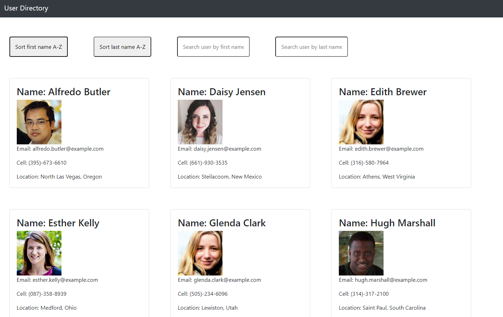
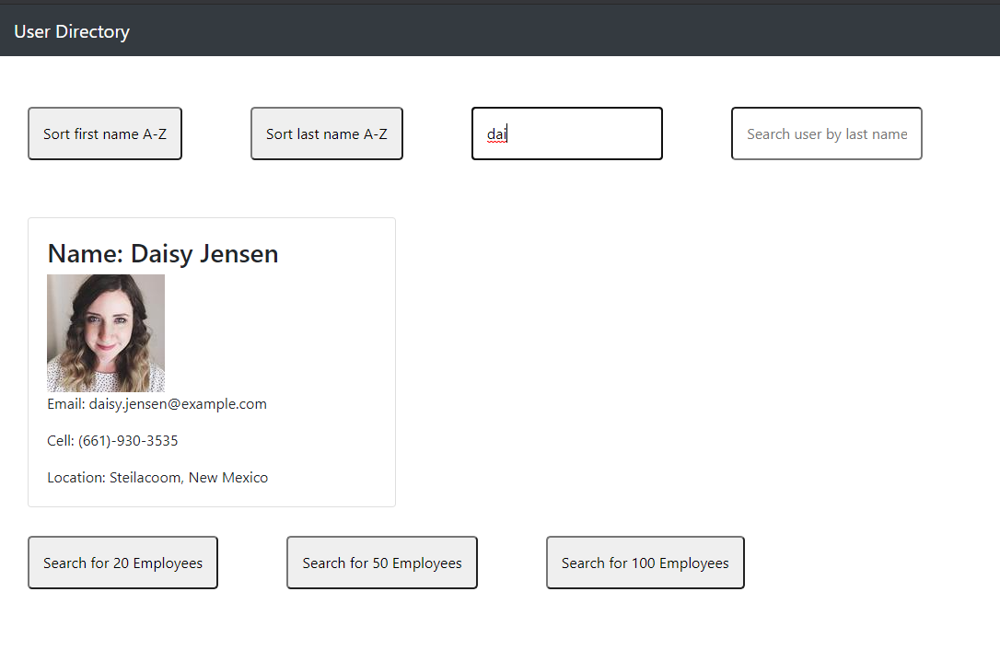
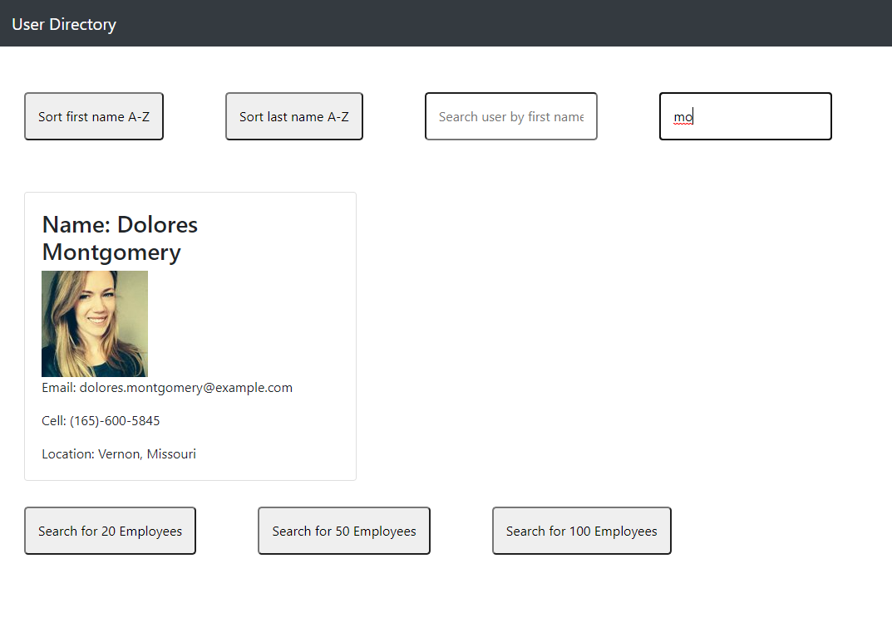

#  [React User Directory]() 

 

This app was created with the React.js library.  When the pages is opened, it makes an API call and stores the data via the new react Hook methods into "state".  There are buttons that are created that allow the user to filter the first and last name A-Z.  Also, there is a search bar than enables the user to search for an employee.  Adittionally there is added functionality at the bottom of the page that allows the user to search for more than the 10 employee default value.  Other thechnoligies that were used are Javascript, Bootstrap, Node.js and of course Javascript.

 
 

Created by: Vincent Doria Jr.
